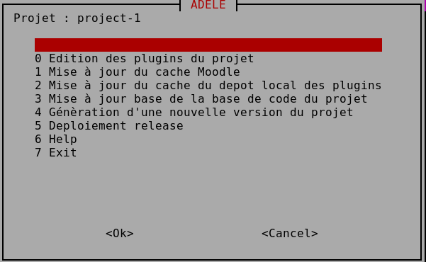

Le fichier de configuration comprend 2 parties:

1. la version de Moodle
2. la liste des plugins

## Version Moodle

La version de Moodle est composée de 3 chiffres: par exemple 4.4.1

Les 2 premiers chiffres indiquent la version majeure voir 
A chaque version majeure correspond une branche git spécifique

Le paramétre version est renseigné de la façon suivante:

| Version         | Source obtenu                                     
| --------------- | --------------------------------------------- 
| `4.4`           | derniere version  releasée dans la branche  (ici 4.4.4)
| `4.4+`          | derniere mise à jour de la barnche : derniere release + fixes
| `4.4.3`         | version spécifique       
| `v4.4.4.2`      | version spécifique : tag                      
| `b097840`       | version spéfique : hash            

## Version des plugins 

Les parametres suivnats sont  obligatoires :

```
moodle-filter_filtercodes: <-  nom du plugin
    repo: github           <-  depot source
    owner: michael-milette <-  propriétaire du depot
    branch: master         <-  branche du dépot
```

***Attention à respecter l'indentation***

Le nom du plugin à indiquer est le nom complet selon la régle [franken style](https://moodle.org/mod/glossary/showentry.php?eid=10113&displayformat=dictionary)

### les parametres optionnels

- original_name
Si le plugin était dans le dépot sous un nom qui ne respecte pas la convention prédédente indiquez le avec le champ original_name

- version
par défaut on récupere la derniere version commitée dans la branche indiquée
si on souhaite une version spécifique on l'indique avec le parametre version suivi d'un tag ou d'un hash   

- localdev

permet de gerer en local une version personnalisée du plugin avec une branche locale 

## Ordre de priorité de prise en compte des parametres de version

 1. localdev
 2. version
 3. branch

Les options du Menu

